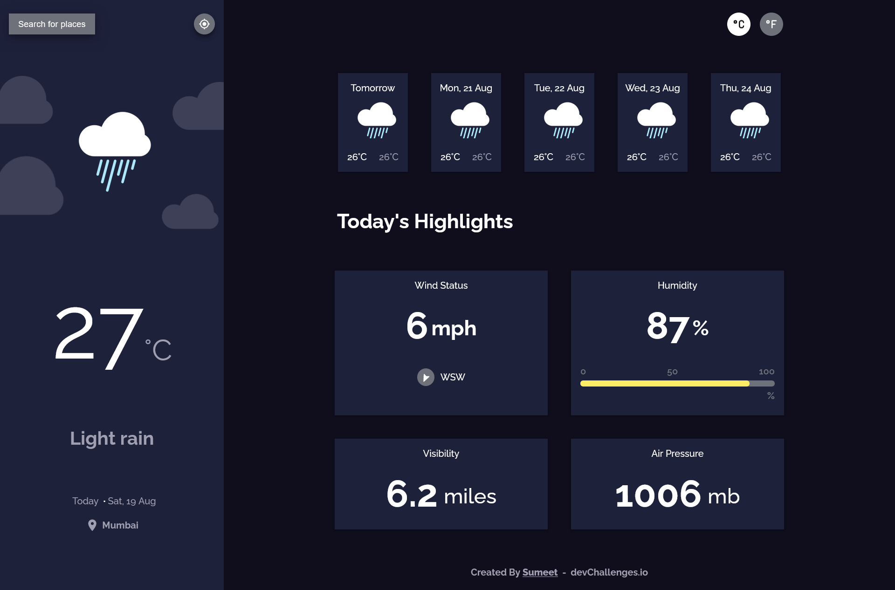

# SkyMoods 🌦️

A beautifully designed weather forecast web application. Inspired by designs from [devChallenges.io](https://devChallenges.io).



## 🌟 Features

- Fetch weather forecasts for any city worldwide.
- Toggle temperature views between Celsius and Fahrenheit.
- Peek into a 5-day weather forecast.

## 🚀 Getting Started

#### Prerequisites:

Ensure you have `node` and `npm` (or `yarn`) installed.

#### Installation:

1. Clone the repository:

   ```bash
   git clone https://github.com/CodeSumeet/SkyMoods.git
   ```

2. Navigate into the directory and install dependencies:

   ```bash
   cd SkyMoods
   npm install
   ```

3. Start the development server:
   ```bash
   npm start
   ```

## 🛠 Built With

- **React** - Web framework used.
- **Axios** - Promise-based HTTP client.
- **Material-UI** - Popular React UI framework.
- **OpenWeatherMap API** - Source for real-time weather data.

## 🔗 Links

- [Project Homepage](https://skymoods.vercel.app)
- [Repository](https://github.com/CodeSumeet/SkyMoods)

## ✍️ Author

**Sumeet Tiwari**

- Student at Thakur College of Science and Commerce.
- Passionate about web development.
